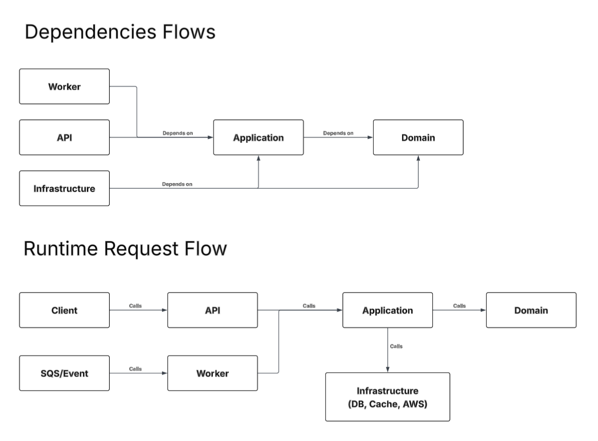
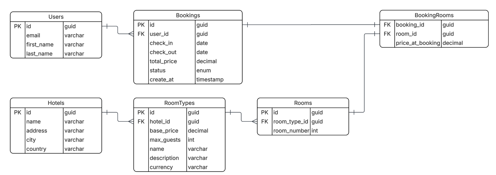

# Hotel Booking MVP SPEC

- [Hotel Booking MVP SPEC](#hotel-booking-mvp-spec)
  - [Functional](#functional)
  - [Non-Functional](#non-functional)
  - [Software Architecture](#software-architecture)
  - [Database Design \& Modeling](#database-design--modeling)
  - [Deployment to AWS (Need Refinement)](#deployment-to-aws-need-refinement)

## Functional

1. A user must be able to search hotel by location in Thailand
2. A user must be able see room type and its details
3. A user must be able to book a room with check in and out date.
4. A user must be able to book with Guest or Registered account
5. A user must be able see room availabilities selected room type and hotel

## Non-Functional

1. The system should load search results under 2 seconds
2. The system must not allow two people to book the same room at the same time

## Software Architecture

- Modular Monolith
  - For small project like this one, it may be better to go with Monolith architecture.
  - However, for learning purposes. I decided to go with Modular Monolith. It would help me think of the backend application in clean architecture and layer. Prepare myself for learning micro-services architecture in the future.
- Clean Architecture
  1.  Domain
  2.  Application
  3.  Infrastructure
  4.  API
  5.  Worker (later)

## Database Design & Modeling

- PostgreSQL
- Model
  - Users
  - Rooms
  - RoomTypes
  - Hotels
  - Bookings
  - BookingRooms

## Deployment to AWS (Need Refinement)

- ECS Fargate
- RDS
